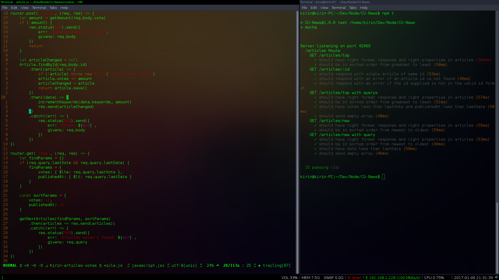
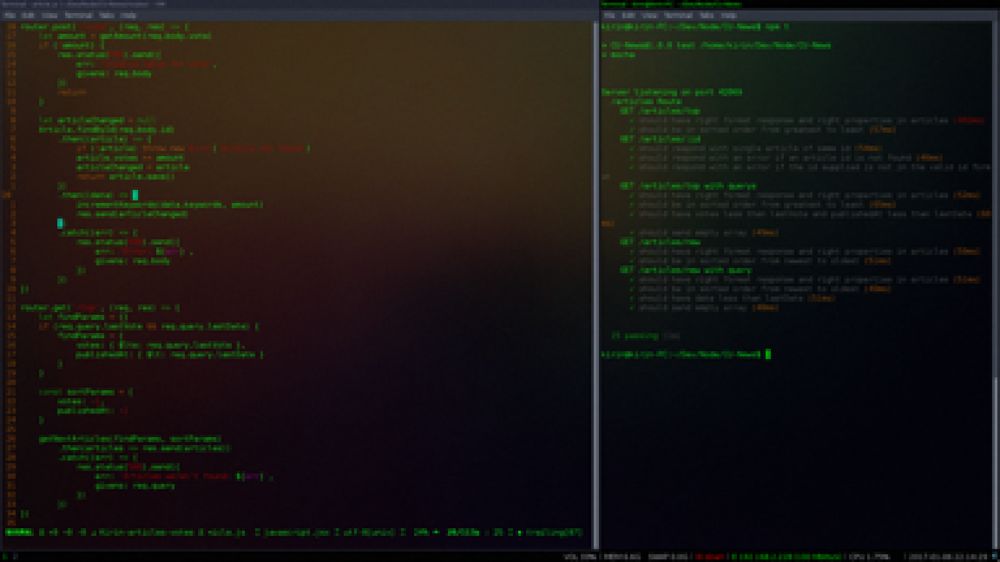

## Kirin Rastogi's dotfiles
Dotfiles for my linux desktop. Almost all files are copied from https://github.com/jackychiu <br/>

## List of things I use
- debian https://www.debian.org/
- i3 window management https://i3wm.org/
- vim
- feh for background management https://wiki.archlinux.org/index.php/feh
- ffmpeg for locking and blurring the screen https://ffmpeg.org/

## Installing
If you want to checkout my enviroment you can use my setup script or manually copy paste all the dotfiles into your `~` dir
```bash 
git clone https://github.com/kirinrastogi/dotfiles.git
cd dotfiles
./setup.sh
```

If you don't have Vundle for vim installed in your `.vim` dir
```bash
git clone https://github.com/VundleVim/Vundle.vim.git ~/.vim/bundle/Vundle.vim
```

Install plugins for vim
```bash
vim ~/.vimrc
:PluginInstall
```

## Desktop image with vim


## Similar image after being locked

